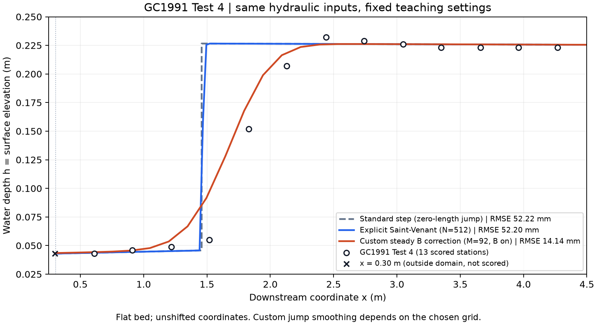

# GC1991 水躍教學實驗室

用 **Python standard-step、Basilisk 顯式 Saint-Venant、自訂淺水模式**，重現同一組 GC1991 Test 4 水面資料。本教材適合大學部專題：先跑通、看懂水理，再閱讀需要的程式段落。

第一版固定已驗收的案例設定，不要求學生做長時間計算或網格收斂研究。教師維護 C 核心；學生操作一本 Notebook，取得三種方法與實驗的比較圖。



| 方法 | 學習重點 | 固定設定 | 實驗水深 RMSE |
|---|---|---|---|
| Python standard-step | 能量方程、急／緩流分支、比力匹配 | 步距 0.005 m，零長度水躍 | 約 52.22 mm |
| Basilisk Saint-Venant | 深度平均守恆與突變捕捉 | 512 格，模擬 1200 s，平均 1000–1200 s | 約 52.20 mm |
| Basilisk C 自訂模式 | 穩態 B 修正與數值平滑的作用 | M92／93 節點，B on，模擬 300 s，平均 200–300 s | 約 14.14 mm |

三者使用相同水理條件及原始量測座標，各自保留確認過的數值設定。自訂模式較接近這一組實驗水面，但上升寬度依賴網格；這不是滾流、紊流或水躍內部流速的驗證。詳見[方法與限制](docs/methods.md)。

## 第一次使用

1. 依電腦平台完成[Windows／WSL 安裝](docs/install-windows.md)或[macOS 安裝](docs/install-macos.md)。
2. 在教材資料夾執行 `bash setup.sh`，建立本機環境。
3. 執行 `bash start_lab.sh`，用瀏覽器開啟終端機顯示的網址。
4. 打開 `student_lab.ipynb`，選擇 **GC1991 Lab**，從上到下執行。

日後只需第 3–4 步。完整步驟與預期畫面見[操作指南](docs/quickstart.md)。不使用 Notebook 時，可在教材資料夾執行：

```bash
.venv/bin/python lab.py all
```

每次計算會建立新的 `runs/` 子資料夾，保存實際輸入、原始水面、檢查結果、編譯與執行紀錄；比較圖另存 PNG 和 PDF。SV 的「1200 s」是物理模擬時間，並非電腦必須等待 20 分鐘。實測耗時見[本機驗證紀錄](docs/verification.md)。

## 教材導覽

- [操作指南與簡短作業](docs/quickstart.md)
- [方程、計算區域、邊界條件與方法對照](docs/methods.md)
- [程式導讀：從水理公式找到程式](docs/code-guide.md)
- [安裝或執行問題](docs/troubleshooting.md)
- [教師維護、驗收範圍與發行](docs/instructor.md)
- [資料來源、引用與第三方授權](THIRD_PARTY_NOTICES.md)

核心程式在 `core/`，共同設定在 `cases/test4.json`，實驗資料在 `data/`，既有基準在 `reference/`。本版會檢查輸入是否仍是固定教學案例，以免改錯參數後誤稱通過驗收；Python 繪圖與分析可自行修改。

此為 **v1 本機發行候選版**。macOS 驗證結果記錄在上述驗證頁；Windows／WSL 實機驗證尚待完成。目前尚未發布 GitHub，也沒有需要設定的 GitHub 帳號或權杖。
